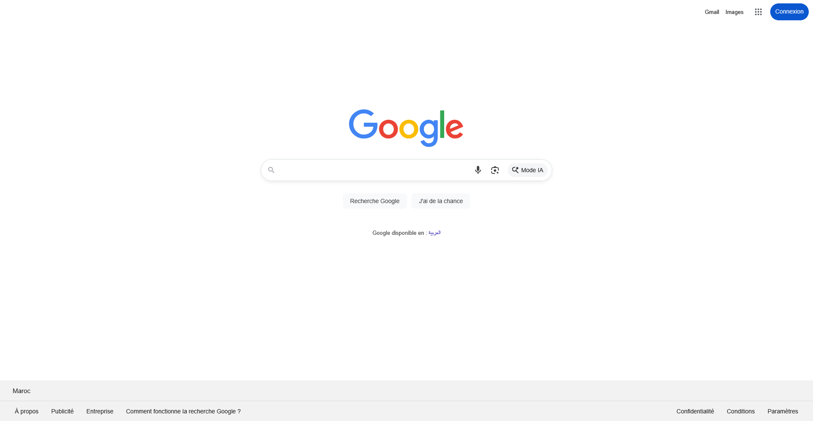
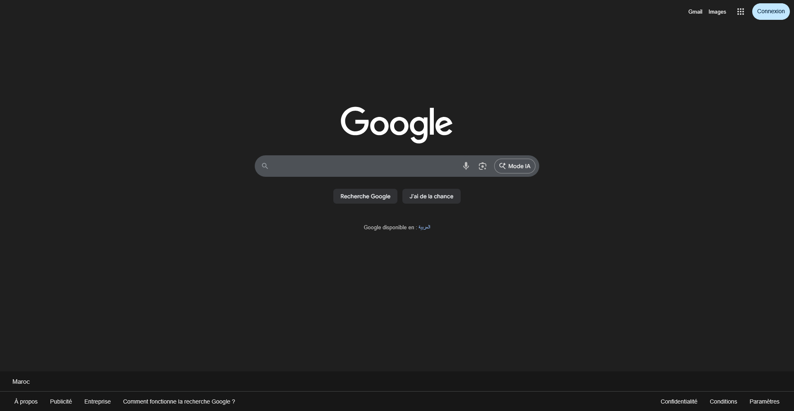
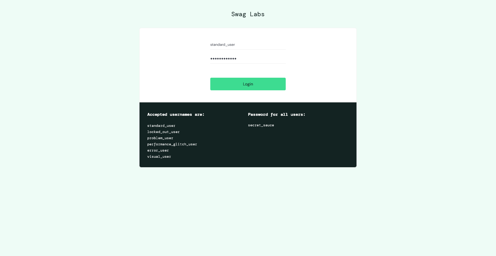
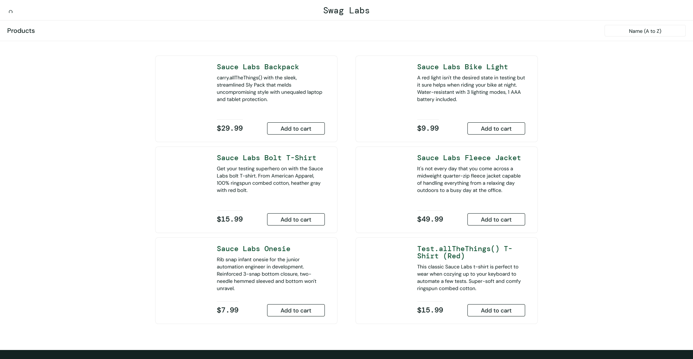
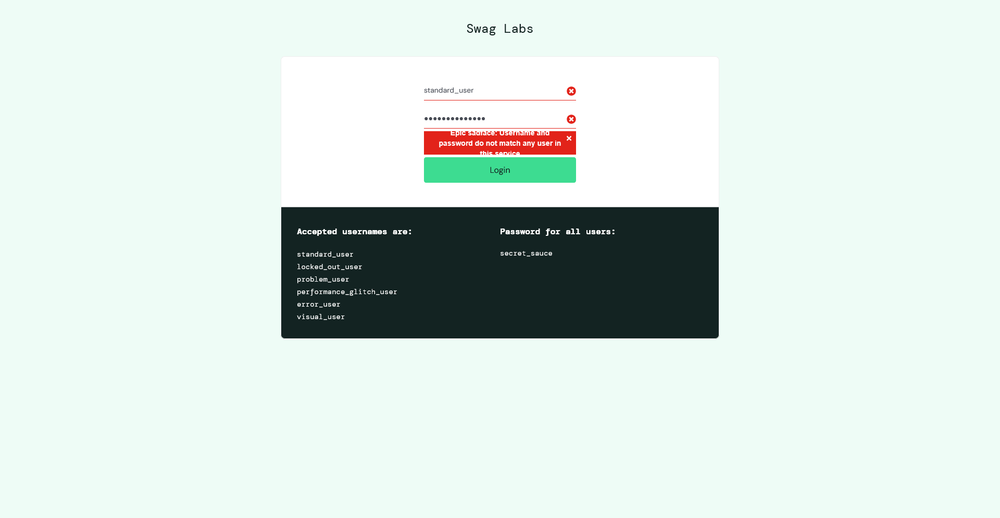
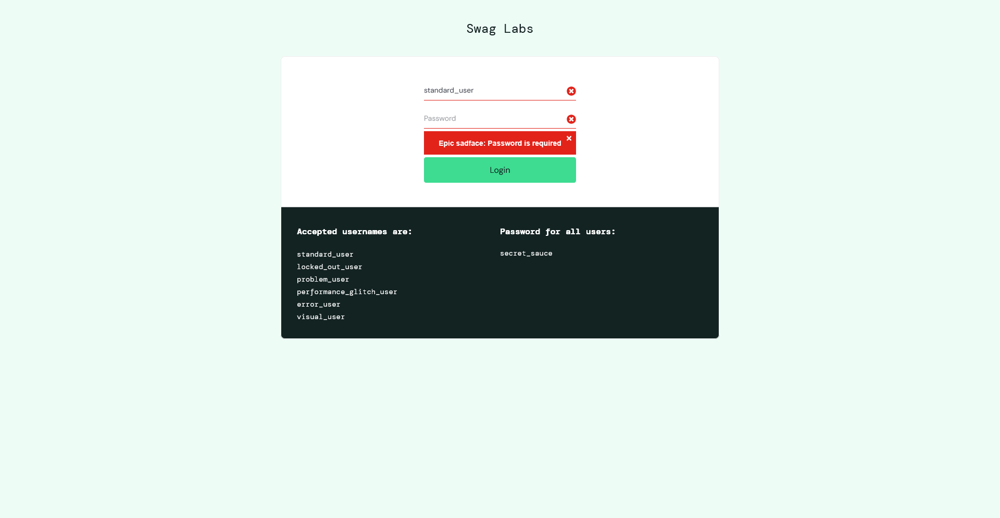
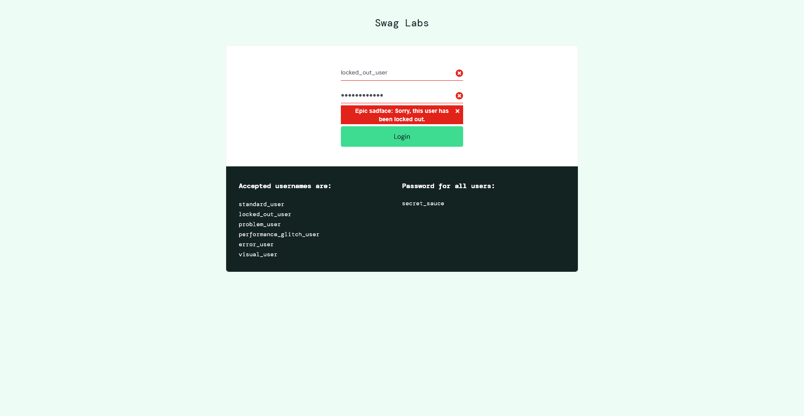
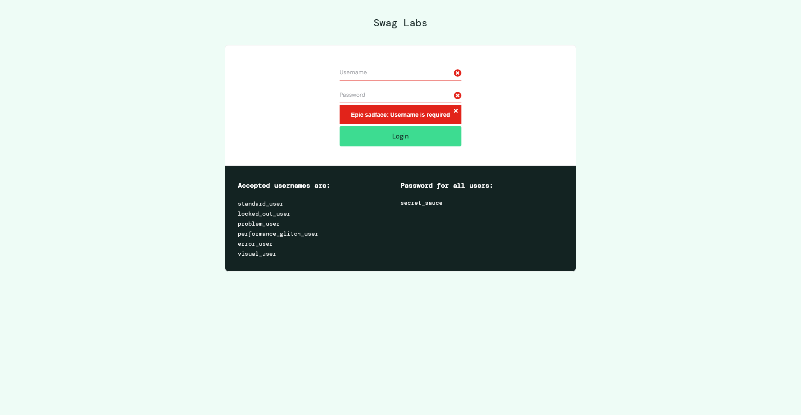
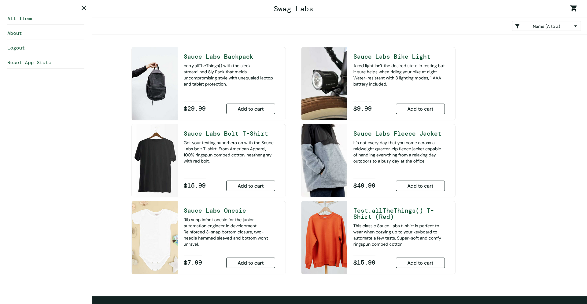
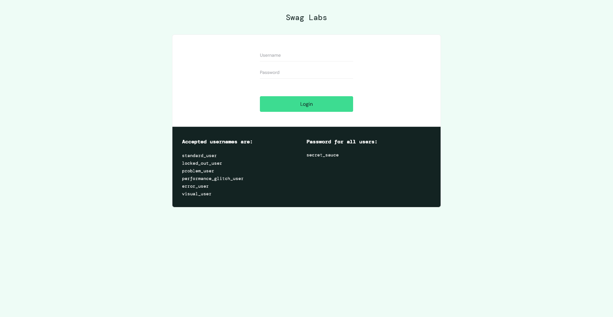

# 📋 TP Selenium WebDriver - Tests Automatisés

## 📌 Informations du Projet

| Élément | Détail |
|---------|--------|
| **Projet** | TP Selenium WebDriver |
| **Auteur** | ACHRAF |
| **Date** | 09/12/2024 |
| **Environnement** | Windows 11, Firefox Developer Edition |
| **Outils** | Selenium 4.10.0, JUnit 5, Maven |

---

## 🎯 Objectifs du TP

1. Comprendre l'architecture de Selenium WebDriver
2. Créer un projet Java utilisant Selenium
3. Utiliser les principaux locators (id, name, className, cssSelector, xpath)
4. Écrire et exécuter des scripts de test automatisés
5. Utiliser des assertions JUnit pour vérifier les résultats

---

## 📁 Structure du Projet

```
TP2_TEST/
├── pom.xml                                        # Configuration Maven
├── README.md                                      # Ce fichier
├── RAPPORT.md                                     # Rapport détaillé
├── screenshots/                                   # Captures d'écran des tests
└── src/
    ├── main/java/com/tp/selenium/
    │   ├── PremierTestSelenium.java              # Activité 1
    │   ├── RechercheGoogle.java                  # Activité 2
    │   └── ScreenshotUtils.java                  # Utilitaire screenshots
    └── test/java/com/tp/selenium/
        ├── RechercheGoogleTest.java              # Activité 9 - 4 tests
        ├── GoogleSearchPlanTest.java             # Activité 10 - 9 tests
        └── LoginFormTest.java                    # Activité 11 - 7 tests
```

---

## 🧪 Résultats des Tests

### ✅ Résumé Global

| Classe de Test | Tests Exécutés | Réussis | Échecs | Temps |
|----------------|----------------|---------|--------|-------|
| RechercheGoogleTest | 4 | ✅ 4 | 0 | ~85s |
| GoogleSearchPlanTest | 9 | ✅ 9 | 0 | ~244s |
| LoginFormTest | 7 | ✅ 7 | 0 | ~8s |
| **TOTAL** | **20** | ✅ **20** | **0** | ~5min 38s |

---

## 📸 Activité 9 : Tests JUnit - Recherche Google

### Test 1 : Page d'accueil Google
**Description** : Vérifie que la page d'accueil Google s'affiche correctement.



---

### Test 2 : Présence du champ de recherche
**Description** : Vérifie que le champ de recherche est présent et visible.



---

## 📸 Activité 11 : Plan de Test - Formulaire de Connexion

### Site de test : [SauceDemo](https://www.saucedemo.com)

### CT-L01 : Connexion réussie

**Avant connexion** : Formulaire rempli avec identifiants valides



**Après connexion** : Redirection vers la page d'inventaire



---

### CT-L02 : Mot de passe incorrect
**Données** : standard_user / wrong_password  
**Résultat** : Message d'erreur "Username and password do not match"



---

### CT-L03 : Login vide
**Données** : (vide) / secret_sauce  
**Résultat** : Message d'erreur "Username is required"


---

### CT-L04 : Mot de passe vide
**Données** : standard_user / (vide)  
**Résultat** : Message d'erreur "Password is required"



---

### CT-L05 : Compte verrouillé
**Données** : locked_out_user / secret_sauce  
**Résultat** : Message d'erreur "locked out"



---

### CT-L06 : Deux champs vides
**Données** : (vide) / (vide)  
**Résultat** : Message d'erreur



---

### CT-L07 : Déconnexion

**Menu ouvert** :



**Après déconnexion** : Retour à la page de login



---

## 🚀 Comment exécuter les tests

### Prérequis
- Java 17+
- Maven 3.9+
- Firefox Developer Edition installé
- GeckoDriver téléchargé

### Commandes

```bash
# Compiler le projet
mvn compile

# Exécuter tous les tests
mvn test

# Exécuter une classe spécifique
mvn test -Dtest=LoginFormTest

# Exécuter avec rapport détaillé
mvn test -Dsurefire.useFile=false
```

---

## 📝 Configuration

### Chemin GeckoDriver
```java
System.setProperty("webdriver.gecko.driver",
    "C:\\Users\\ACHRAF\\Downloads\\geckodriver-v0.36.0-win32\\geckodriver.exe");
```

### Chemin Firefox Developer Edition
```java
FirefoxOptions options = new FirefoxOptions();
options.setBinary("C:\\Program Files\\Firefox Developer Edition\\firefox.exe");
```

---

## 📊 Technologies utilisées

| Technologie | Version |
|-------------|---------|
| Java | 17+ |
| Selenium WebDriver | 4.10.0 |
| JUnit | 5.10.1 |
| Maven | 3.9+ |
| Firefox | Developer Edition 147.0 |
| GeckoDriver | 0.36.0 |

---

## ✍️ Auteur

**ACHRAF**  

